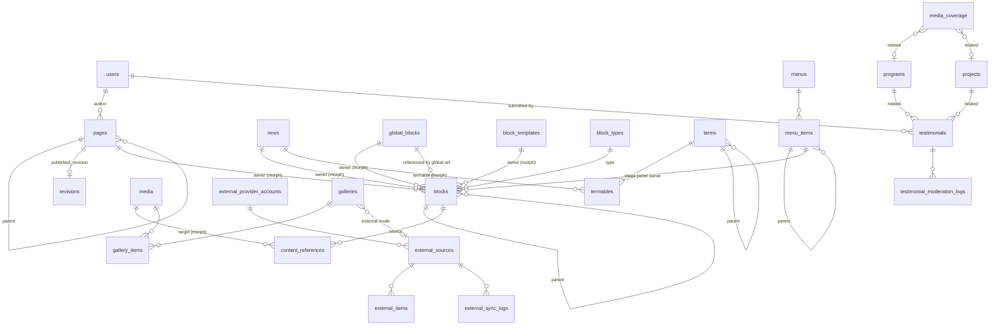

# Probha Aurora CMS — Database Architecture

| | |
|---|---|
| Document | DATABASE-ARCHITECTURE.md (Phase 1 deliverable B) |
| Status | Draft for team review, not yet migrated |
| Engine | MySQL 8.0+ / 8.4 LTS, InnoDB, `utf8mb4` / `utf8mb4_unicode_ci` |
| Related | [CMS-ARCHITECTURE.md](CMS-ARCHITECTURE.md), [CMS-BLOCK-SCHEMA.md](CMS-BLOCK-SCHEMA.md) |

---

## 1. Conventions

| Topic | Rule |
|---|---|
| Primary keys | `id BIGINT UNSIGNED AUTO_INCREMENT` (Laravel `id()`). |
| Public/stable identifiers | `uuid CHAR(26)` ULIDs where an ID leaves the database in portable form (blocks, media, import jobs) or must not be guessable. Numeric IDs are fine in admin URLs. |
| Timestamps | `created_at`, `updated_at` (UTC). App timezone for display: `Asia/Dhaka` (configurable setting). |
| Soft deletes | `deleted_at` on user-facing content (pages, all content modules, menus, global blocks, templates, custom block types, external sources). **Not** on media (deletion is permanent and removes the files, so a "deleted" file can never stay publicly reachable — Phase 3 decision), join, log or cache tables. |
| Authorship | `created_by`, `updated_by` → `users.id` **ON DELETE SET NULL** (content outlives accounts). |
| Enums | `VARCHAR(32)` backed by PHP enums, not MySQL `ENUM`, so adding a value never needs an `ALTER`. Validated in app code. |
| JSON | Used only for block configuration (`content/source/display/layout/style/responsive/advanced`), custom block field definitions, provider config, snapshots, image variants, logs' metadata, and settings values. **Never for anything we filter or join on.** |
| Slugs | `VARCHAR(191)`, unique per type (`UNIQUE(slug)` with soft-delete awareness: a trashed row keeps its slug until force-deleted, and restore checks for collisions). |
| Foreign keys | Always declared. `CASCADE` only for pure children (block → children, menu_items → children, pivot rows). `RESTRICT` where deletion would orphan meaning (a term in use, a block type with instances). `SET NULL` for optional references. |
| Polymorphism | Laravel morph map with short aliases (`page`, `news`, `event` …), so class renames never break data. Morph columns: `*_type VARCHAR(32)`, `*_id BIGINT UNSIGNED`, composite index. |
| Money/decimal | n/a |
| Optimistic locking | `lock_version INT UNSIGNED` on pages, global blocks, templates, block types, menus (builder saves). |

---

## 2. Changes from the master prompt's candidate list

| Candidate table(s) | Decision | Reason |
|---|---|---|
| `page_blocks`, `block_revisions` | → **`blocks`** (polymorphic owner) + generic **`revisions`** | Blocks belong to pages, news, events, projects, programs, global blocks, templates, custom types and mega menus. One tree table serves all owners. Revisions snapshot the whole owner including its tree. |
| `block_fields` | → `block_types.fields` (JSON) | Field definitions are nested (repeaters in repeaters), always read and written as a whole, and never queried individually. JSON is the right fit here. Validated against the field meta-schema. |
| `news_categories`, `news_tags`, `media_categories`, `media_tags`, `media_coverage_categories`, `media_coverage_tags` | → **`terms`** + **`termables`** | One taxonomy system for all types (hierarchical, admin-managed). Adding taxonomies for future types needs no migration. |
| `rss_sources`, `rss_items`, `social_accounts`, `social_posts`, `gallery_sources` | → **`external_provider_accounts`**, **`external_sources`**, **`external_items`**, `external_sync_logs` | One provider framework, not four parallel ones. |
| `rss_feeds` (outbound) | → config + settings (no table) | Outbound feeds are a fixed list generated from content types. Titles and descriptions are settings. |
| `teams` | → **`team_members`** | Avoids confusion with Laravel/Jetstream "teams" (tenancy). |
| `testimonial_moderation` | → **`testimonial_moderation_logs`** | Moderation state lives on `testimonials.status`. The log is the history. |
| `seo_metadata`, `activity_logs`, `settings`, `media`, `menus`, `menu_items`, `galleries`, `gallery_items`, `media_coverage` | kept | |
| — | **added** `content_references`, `search_documents`, `redirects`, `import_jobs`, `attachments`, `partnerables`, `slug_history` (inside `redirects`), `testimonial_moderation_logs` | Reference integrity (media/global/entity usage), search, SEO redirects, JSON import plans, documents on projects/programs, partner links. |

---

## 3. Entity-relationship overview



Text summary of groups:

```
IDENTITY & ACCESS   users · roles · permissions · model_has_roles · model_has_permissions · role_has_permissions
                    personal_access_tokens · sessions · password_reset_tokens
CMS CORE            pages · blocks · block_types · block_templates · global_blocks · revisions
                    content_references · seo_metadata · redirects · settings
TAXONOMY            terms · termables
CONTENT MODULES     news · events · projects · programs · publications · team_members · partners
                    testimonials · testimonial_moderation_logs · media_coverage · galleries · gallery_items
                    attachments · partnerables
MEDIA               media
NAVIGATION          menus · menu_items
EXTERNAL            external_provider_accounts · external_sources · external_items · external_sync_logs
SEARCH              search_documents
SYSTEM              activity_logs · import_jobs
FRAMEWORK           cache · cache_locks · jobs · job_batches · failed_jobs
```

---

## 4. Identity and access

### users
| Column | Type | Notes |
|---|---|---|
| id | bigint PK | |
| name | varchar(191) | |
| email | varchar(191) UNIQUE | |
| email_verified_at | timestamp null | Required for testimonial submission and admin access |
| password | varchar(255) | bcrypt/argon2id via Laravel `hashed` cast |
| two_factor_secret, two_factor_recovery_codes | text null | Fortify, encrypted |
| two_factor_confirmed_at | timestamp null | |
| status | varchar(16) | `active` / `suspended` (suspended cannot log in) |
| avatar_media_id | FK media null, SET NULL | added in Phase 3 together with the `media` table |
| last_login_at, last_login_ip | timestamp/varchar(45) null | |
| remember_token, timestamps, deleted_at | | |

Spatie tables (`roles`, `permissions`, `model_has_roles`, `model_has_permissions`, `role_has_permissions`) are used as published by the package, with team support disabled. Sanctum `personal_access_tokens` is kept for future API clients; the SPA uses cookie sessions. `sessions` uses the database session driver.

---

## 5. CMS core

### pages
| Column | Type | Notes |
|---|---|---|
| id | PK | |
| parent_id | FK pages null, RESTRICT | Hierarchical pages |
| title | varchar(255) | working copy |
| slug | varchar(191) | segment |
| path | varchar(512) | full working path `about/our-team`, recomputed on parent/slug change |
| published_path | varchar(512) null **UNIQUE** | path of the published snapshot; public routing uses this |
| excerpt | text null | |
| featured_media_id | FK media null, SET NULL | |
| template | varchar(32) | page layout: `default`, `full-width`, `landing` (no chrome) |
| show_title | bool, default true | show the default page header (title, summary). When false the H1 stays, visually hidden. Added after the Phase 4 review |
| header_global_block_id, footer_global_block_id | FK global_blocks null, SET NULL | null = site default |
| status | varchar(16) | draft / in_review / approved / published / archived |
| has_unpublished_changes | bool | working copy differs from published snapshot |
| published_revision_id | FK revisions null, SET NULL | the live snapshot |
| publish_at | timestamp null | scheduled publish |
| published_at, first_published_at | timestamp null | |
| custom_css | mediumtext null | sanitized, permission-gated |
| author_id | FK users null, SET NULL | |
| lock_version | int unsigned | |
| created_by, updated_by, timestamps, deleted_at | | |

Indexes: `UNIQUE(published_path)`, `INDEX(parent_id, slug)`, `INDEX(status, publish_at)`, `INDEX(author_id)`.
The homepage is `settings.site.homepage_page_id` (not a flag column, so there is exactly one).

### blocks
| Column | Type | Notes |
|---|---|---|
| id | PK | |
| uuid | char(26) UNIQUE | stable across saves, used by builder, CSS scope, import/export |
| owner_type, owner_id | morph | page, news, event, project, program, publication, global_block, block_template, block_type (custom structure), menu_item (mega) |
| parent_id | FK blocks null, **CASCADE** | |
| position | int unsigned | order among siblings (gapless, rewritten on save) |
| block_type_id | FK block_types, **RESTRICT** | |
| global_block_id | FK global_blocks null, RESTRICT | only for `global-ref` blocks |
| name | varchar(120) null | admin label |
| content, source, display, layout, style, responsive, advanced | json null | see CMS-BLOCK-SCHEMA.md |
| is_hidden | bool | |
| created_by, updated_by, timestamps | | no soft delete, since history lives in revisions |

Indexes: `INDEX(owner_type, owner_id, parent_id, position)`, `INDEX(block_type_id)`, `INDEX(global_block_id)`.
Tree loading: `SELECT … WHERE owner_type=? AND owner_id=? ORDER BY parent_id, position` → assembled in PHP.

**Phase 4 implementation notes:** `uuid` is a lowercase ULID (`char(26)`). `global_block_id` is not created yet; it arrives with global blocks in Phase 5. The composite index is named `blocks_owner_tree_index`. Saving replaces all of an owner's rows in one transaction, and uuids are kept. Live content never reads these rows directly: the published page snapshot (revision) holds the block tree.

### block_types
| Column | Type | Notes |
|---|---|---|
| id | PK | |
| slug | varchar(100) UNIQUE | `heading`, `news`, `custom/staff-profile` (custom slugs are prefixed `custom/`) |
| name, description | varchar/text | |
| category | varchar(32) | basic, layout, content, media, organization, dynamic, external, structural, custom |
| icon | varchar(64) | Bootstrap Icons name |
| is_core | bool | core rows are synced from PHP classes and read-only in admin |
| status | varchar(16) | draft / published / disabled (disabled = not insertable, existing instances still render) |
| fields | json | field definitions (custom) / cached export of PHP definition (core) |
| capabilities | json | `sourceModes`, `displayModes`, `allowedChildren`, `allowedParents`, `maxChildren` |
| defaults | json | default content/layout/style |
| version | int unsigned | increments on publish |
| published_revision_id | FK revisions null | custom types: compiled published structure |
| lock_version, created_by, updated_by, timestamps, deleted_at | | |

**Phase 4 implementation notes:** only the core columns exist (slug, name, description, category, icon, is_core, status, fields, capabilities, defaults, version, timestamps). Core rows are synced from the PHP classes by `pacms:blocks:sync` (also run by `ProductionSeeder`). `published_revision_id`, `lock_version`, the author columns and soft delete come with custom block types in Phase 5.

### global_blocks
| Column | Type | Notes |
|---|---|---|
| id, name | | |
| slug | varchar(191) UNIQUE | |
| kind | varchar(16) | `header`, `footer`, `generic` |
| status, has_unpublished_changes, published_revision_id, published_at | | staged publishing |
| lock_version, created_by, updated_by, timestamps, deleted_at | | |

### block_templates
| Column | Type | Notes |
|---|---|---|
| id, name, slug UNIQUE, description | | |
| scope | varchar(16) | `block`, `section`, `page` |
| category | varchar(64) | palette grouping |
| thumbnail_media_id | FK media null | |
| status, published_revision_id, lock_version | | |
| is_system | bool | shipped starter templates (restorable) |
| created_by, updated_by, timestamps, deleted_at | | |

### revisions
| Column | Type | Notes |
|---|---|---|
| id | PK | |
| revisionable_type, revisionable_id | morph | |
| number | int unsigned | per item, `UNIQUE(revisionable_type, revisionable_id, number)` |
| kind | varchar(16) | manual, published, autosave, restore, import |
| snapshot | json (longtext) | fields + terms + seo + tree in schema format |
| schema_version | varchar(8) | of the snapshot format |
| summary | varchar(255) null | "Changed title; moved 2 blocks" (auto) or user note |
| created_by | FK users null SET NULL | |
| created_at | timestamp | immutable, no updated_at |

Indexes: `INDEX(revisionable_type, revisionable_id, kind, created_at)`.
Retention: all `published`, and the last 50 others per item (prune job).

### content_references
Answers "where is X used?" for media, global blocks, custom types and entities. It is rebuilt for an owner every time its tree is saved.

| Column | Type | Notes |
|---|---|---|
| id | PK | |
| owner_type, owner_id | morph | page, news, global_block … |
| block_uuid | char(26) null | which block (null = entity field such as featured image) |
| target_type, target_id | morph | media, global_block, block_type, news, program … |
| context | varchar(32) | `featured_image`, `block_content`, `relationship`, `global_ref` |

Indexes: `INDEX(target_type, target_id)`, `INDEX(owner_type, owner_id)`.

### seo_metadata
`id, seoable_type, seoable_id (UNIQUE pair), title, description, canonical_url, robots_index bool, robots_follow bool, og_title, og_description, og_image_media_id (FK media SET NULL), twitter_card, structured_data (json null, validated), timestamps`.

### redirects
`id, source_path varchar(512) UNIQUE, target_path varchar(1024), status_code smallint (301/302/307/308), is_auto bool (slug change), hits int, last_hit_at, created_by, timestamps`.

### settings
`id, group varchar(64), key varchar(128), value json, is_public bool, updated_by, timestamps, UNIQUE(group, key)`.
Groups: `site` (name, logo, homepage, default header/footer, timezone, contact), `design` (tokens), `seo` (defaults, robots.txt), `feeds`, `integrations` (non-secret), `privacy`. Secrets are **never** stored here (use `.env` or encrypted provider accounts). Settings are cached as one blob per group.

---

## 6. Taxonomy

### terms
| Column | Type | Notes |
|---|---|---|
| id | PK | |
| taxonomy | varchar(64) | `news_category`, `tag`, `publication_category`, `partner_category`, `department`, `media_category`, `media_coverage_category`, `event_category` … (registered in config) |
| parent_id | FK terms null, RESTRICT | hierarchical taxonomies |
| name | varchar(191) | |
| slug | varchar(191) | `UNIQUE(taxonomy, slug)` |
| description | text null | |
| position | int unsigned | |
| timestamps, deleted_at | | |

### termables
`term_id FK terms CASCADE, termable_type, termable_id, position` · `PRIMARY(term_id, termable_type, termable_id)` · `INDEX(termable_type, termable_id)`.
Deleting a term that is in use is blocked by the service layer, not the FK: the admin must merge or reassign first.

---

## 7. Content modules

All publishable modules share these **publishable columns**:
`status varchar(16), published_at timestamp null, publish_at timestamp null, featured bool default 0, author_id FK users SET NULL, created_by, updated_by, timestamps, deleted_at` with `INDEX(status, published_at)` and `INDEX(featured, status, published_at)`.

### news
`id, title, slug UNIQUE, excerpt text, featured_media_id FK media SET NULL` + publishable columns. Body = block tree (owner `news`). Category and tags via terms.

**Phase 4 (minimal News, decision D-04):** created without `publish_at` (no scheduling yet) and without staged publishing. Category taxonomy `news_category`. Body blocks, scheduling, revisions and the archive page arrive with the full News module in Phase 8.

### events
`id, title, slug UNIQUE, excerpt, featured_media_id, start_at datetime, end_at datetime null, all_day bool, timezone varchar(64), venue varchar(255), address text, map_url varchar(1024) null, registration_url varchar(1024) null, organizer varchar(255)` + publishable. `INDEX(status, start_at)` for "upcoming". Body = blocks.

### projects
`id, name, slug UNIQUE, excerpt, featured_media_id, project_status varchar(16) (planned/ongoing/completed/paused), start_date date null, end_date date null, location varchar(255), manager_team_member_id FK team_members SET NULL, manager_name varchar(191) null, gallery_id FK galleries SET NULL, website_url` + publishable. Partners via `partnerables`. Documents via `attachments`. Body = blocks.

### programs
`id, name, slug UNIQUE, excerpt, featured_media_id, objectives json (repeater: text), activities json (repeater: title, text), gallery_id FK galleries SET NULL` + publishable. Partners via `partnerables`. Documents via `attachments`. Body = blocks.
(Objectives and activities are ordered lists of text that are only ever displayed, so JSON repeaters are appropriate. If they later need their own pages or filters they become tables.)

### publications
`id, title, slug UNIQUE, description (sanitized rich text), cover_media_id, publication_date date, author_text varchar(255), document_media_id FK media SET NULL, external_url` + publishable (with `featured`). Category via terms.

### team_members
`id, name, slug UNIQUE, designation, photo_media_id, biography (rich text), email varchar(191) null, show_email bool default 0, phone null, show_phone bool default 0, social_links json (repeater: network, url), position int, status (active/inactive), timestamps, deleted_at`. Department via terms (`department`). `INDEX(status, position)`.

### partners
`id, name, slug UNIQUE, logo_media_id, description, website_url, position, status (active/inactive), timestamps, deleted_at`. Category via terms (`partner_category`).

### partnerables
`partner_id FK CASCADE, partnerable_type, partnerable_id, role varchar(64) null, position` · PK (partner_id, partnerable_type, partnerable_id).

### attachments
`id, media_id FK media RESTRICT, attachable_type, attachable_id, label varchar(255) null, position, timestamps` · INDEX(attachable_type, attachable_id, position).

### testimonials
| Column | Type | Notes |
|---|---|---|
| id | PK | |
| user_id | FK users null, SET NULL | internal only; null for admin-entered testimonials |
| name, designation, organization | varchar | |
| photo_media_id | FK media null SET NULL | uploaded as private until published |
| body | text | plain text |
| rating | tinyint null | 1–5 |
| citation | varchar(255) null | |
| testimonial_date | date null | |
| program_id, project_id, event_id | FK null SET NULL | |
| website_url | varchar(1024) null | |
| status | varchar(16) | draft, pending, under_review, approved, published, rejected, archived |
| rejection_reason | text null | **internal** |
| consent_given_at | timestamp null | |
| consent_version | varchar(16) null | |
| submitted_ip | varbinary(16) null | internal, for abuse handling, purged after 90 days |
| featured, position, published_at | | |
| reviewed_by | FK users null | |
| timestamps, deleted_at | | |

Indexes: `INDEX(status, published_at)`, `INDEX(user_id)`.

### testimonial_moderation_logs
`id, testimonial_id FK CASCADE, from_status, to_status, actor_id FK users SET NULL, note text null, created_at`.

### media_coverage
| Column | Type | Notes |
|---|---|---|
| id, title, slug UNIQUE | | |
| source_name | varchar(191) | e.g. newspaper name |
| source_url | varchar(2048) null | |
| coverage_type | varchar(16) | newspaper, magazine, tv, radio, online, other |
| publication_date | date | |
| summary | text | sanitized rich text |
| featured_media_id | FK media null | |
| archive_pdf_media_id, archive_video_media_id | FK media null, SET NULL | |
| archive_rights_confirmed | bool | archive public only if true |
| archive_rights_note | text null | |
| program_id, project_id | FK null SET NULL | |
| availability | varchar(16) | unknown, available, unverified, unavailable |
| availability_override | varchar(16) | auto, force_original, force_archive |
| last_checked_at | timestamp null | |
| http_status | smallint null | |
| last_check_error | varchar(512) null | |
| consecutive_failures | tinyint | |
| next_check_at | timestamp null | |
| + publishable columns (with `featured`) | | |

Category and tags via terms. `INDEX(next_check_at)`, `INDEX(coverage_type, status, publication_date)`.

### galleries
`id, title, slug UNIQUE, description, cover_media_id, gallery_type (photo/video/mixed), source_mode (cms/external), external_source_id FK external_sources null SET NULL, gallery_date date null, location, credit, event_id/project_id/program_id FK null SET NULL` + publishable (with `featured`). Tags via terms.

### gallery_items
`id, gallery_id FK CASCADE, media_id FK media null RESTRICT, video_url varchar(1024) null, video_provider varchar(16) null, caption text null, alt_override varchar(255) null, credit varchar(191) null, position` · INDEX(gallery_id, position). Check: exactly one of media_id / video_url.

---

## 8. Media

### media
| Column | Type | Notes |
|---|---|---|
| id | PK | |
| uuid | char(26) UNIQUE | used in URLs/filenames |
| disk | varchar(32) | `public` or `private` |
| path | varchar(512) | `media/2026/09/<ulid>.<ext>` |
| original_name | varchar(255) | display only, never used as a path |
| mime_type | varchar(127) | detected from content |
| extension | varchar(16) | derived from detected MIME |
| kind | varchar(16) | image, video, document, audio |
| size | bigint unsigned | bytes |
| width, height | int null | |
| duration | int null | seconds |
| alt, caption, description, credit | text/varchar | |
| is_decorative | bool | explicit opt-out of alt |
| focal_point | json null | `{x, y}` 0–1 |
| variants | json null | `{"webp":{"320":"…"},"original":{…},"placeholder":"data:…"}` |
| checksum_sha256 | char(64) | duplicate detection, `INDEX` |
| uploaded_by | FK users null SET NULL | |
| timestamps | | no soft delete (see §1) |

Indexes: `INDEX(kind, created_at)`, `FULLTEXT(original_name, alt, caption)` for admin search. Categories and tags via terms.

---

## 9. Navigation

### menus
`id, name, slug UNIQUE (main, footer, secondary, …), location varchar(32) null, lock_version, timestamps, deleted_at`.

### menu_items
| Column | Type | Notes |
|---|---|---|
| id | PK | |
| menu_id | FK menus CASCADE | |
| parent_id | FK menu_items null CASCADE | depth ≤ 4 (validated) |
| position | int unsigned | |
| type | varchar(16) | page, content, term, external_url, custom_url, group |
| label | varchar(191) null | null = use target title |
| linkable_type, linkable_id | morph null | for page/content/term |
| url | varchar(2048) null | external/custom, validated protocols |
| open_in_new_tab | bool | |
| icon | varchar(64) null | |
| css_class | varchar(191) null | validated class tokens |
| visibility | varchar(16) | everyone, guests, members |
| is_mega | bool | top level only; owns a block tree |
| timestamps | | |

Index: `INDEX(menu_id, parent_id, position)`.

---

## 10. External providers

### external_provider_accounts
`id, provider varchar(32), name, credentials text (encrypted JSON), token_expires_at timestamp null, status, last_verified_at, created_by, timestamps, deleted_at`.

### external_sources
| Column | Type | Notes |
|---|---|---|
| id, name | | |
| slug | varchar(191) UNIQUE | referenced by blocks and public API |
| provider | varchar(32) | rss, facebook, flickr, youtube |
| account_id | FK external_provider_accounts null, RESTRICT | |
| config | json | provider-specific, validated by provider (`feed_url`, `page_id`, `album_id` …) |
| description, source_website | | |
| status | varchar(16) | enabled / disabled |
| sync_interval_minutes | smallint | 5, 15, 30, 60, 360, 720, 1440 |
| max_items | smallint | default 50, max 500 |
| last_synced_at, last_success_at, next_sync_at | timestamp null | |
| last_status | varchar(16) | ok, error, never |
| last_error | varchar(1024) null | sanitized message |
| consecutive_failures | smallint | backoff |
| created_by, updated_by, timestamps, deleted_at | | |

Index: `INDEX(status, next_sync_at)`.

### external_items
| Column | Type | Notes |
|---|---|---|
| id | PK | |
| external_source_id | FK CASCADE | |
| external_id | varchar(255) | guid / post id; `UNIQUE(external_source_id, external_id)` |
| item_type | varchar(16) | post, article, image, video |
| title | varchar(512) null | |
| link | varchar(2048) null | validated http(s) |
| excerpt | text null | plain text |
| description | mediumtext null | sanitized HTML |
| author, category | varchar(255) null | |
| image_url | varchar(2048) null | |
| image_media_id | FK media null SET NULL | locally cached copy (Facebook) |
| thumbnail_url | varchar(2048) null | |
| published_at | timestamp null | |
| source_updated_at | timestamp null | |
| raw_data | json null | trimmed provider payload for debugging |
| timestamps | | |

Index: `INDEX(external_source_id, published_at)`.

### external_sync_logs
`id, external_source_id FK CASCADE, trigger (schedule/manual/test), status (ok/error), items_fetched, items_created, items_updated, duration_ms, error text null, created_at` · retained 90 days.

---

## 11. Search and system

### search_documents
`id, searchable_type, searchable_id (UNIQUE pair), title varchar(512), body mediumtext, url varchar(1024), published_at, boost tinyint default 1, timestamps` · `FULLTEXT(title, body)`, `INDEX(searchable_type, published_at)`.

### activity_logs
`id, user_id FK users null SET NULL, action varchar(64), subject_type varchar(32) null, subject_id bigint null, subject_label varchar(255) null, ip varchar(45) null, user_agent_hash char(64) null, properties json null, created_at` · `INDEX(subject_type, subject_id)`, `INDEX(user_id, created_at)`, `INDEX(action, created_at)`.

### import_jobs
| Column | Type | Notes |
|---|---|---|
| id, uuid | | |
| user_id | FK users SET NULL | |
| status | varchar(24) | uploaded, validating, invalid, awaiting_confirmation, importing, completed, failed, expired |
| schema_version | varchar(8) | |
| payload | longtext | original JSON (kept 30 days) |
| plan | json null | resolved plan: entities to create, asset strategies, reference map |
| report | json null | pages, blocks, static/dynamic, missing assets, missing refs, unsupported props, external requirements |
| target_type, target_id | morph null | when importing into an existing page |
| confirmed_at, completed_at, expires_at | timestamp null | |
| timestamps | | |

Framework tables (`cache`, `cache_locks`, `jobs`, `job_batches`, `failed_jobs`) are created by Laravel's default migrations.

---

## 12. Key query paths and supporting indexes

| Query | Index used |
|---|---|
| Public page by path | `pages.published_path` UNIQUE → `revisions.id` PK |
| Latest published news (category) | `news(status, published_at)` + `termables(term_id, …)` |
| Featured news | `news(featured, status, published_at)` |
| Upcoming events | `events(status, start_at)` |
| Load block tree for owner | `blocks(owner_type, owner_id, parent_id, position)` |
| Where is media X used? | `content_references(target_type, target_id)` |
| Due external syncs | `external_sources(status, next_sync_at)` |
| Due coverage checks | `media_coverage(next_check_at)` |
| Search | `search_documents FULLTEXT(title, body)` |
| Menu render | `menu_items(menu_id, parent_id, position)` |
| Moderation queue | `testimonials(status, …)` |

---

## 13. Migration and seeding plan

- Migrations are grouped per phase (Phase 2: identity, settings, activity. Phase 3: pages, revisions, seo, redirects, content references, media core. Phase 4: blocks and block types. …). **No migration is edited after it has run on a shared or production DB.** Changes always go in new migrations.
- Seeders:
  - `RolesAndPermissionsSeeder`: idempotent, safe to run on every deploy.
  - `CoreBlockTypesSeeder`: wraps `pacms:blocks:sync`.
  - `DefaultSettingsSeeder`: neutral placeholders such as "Your Organization", with no real organisational content.
  - `DemoContentSeeder`: local/dev only, never run in production.
- The first administrator is created with `php artisan pacms:create-admin` (interactive CLI), **not** a web installer.
